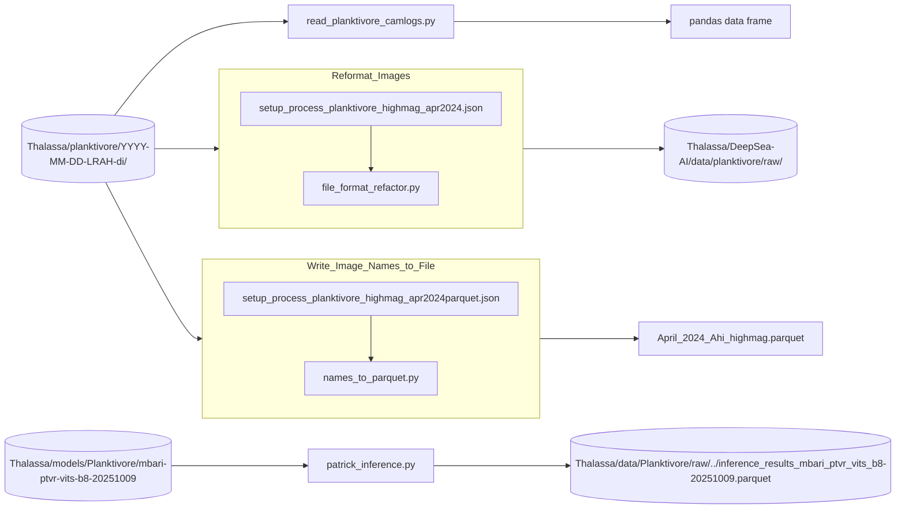

```mermaid
flowchart LR

I[(Thalassa/planktivore/YYYY-MM-DD-LRAH-di/)]
J1[setup_process_planktivore_highmag_apr2024.json]
P1[file_format_refactor.py]
OI[(Thalassa/DeepSea-AI/data/planktivore/raw/)]
J2[setup_process_planktivore_highmag_apr2024parquet.json]
P2[names_to_parquet.py]
O1[April_2024_Ahi_highmag.parquet]
P3[read_planktivore_camlogs.py]
O2[pandas data frame]
M1[(Thalassa/models/Planktivore/mbari-ptvr-vits-b8-20251009)]
P4[patrick_inference.py]
O3[(Thalassa/data/Planktivore/raw/../inference_results_mbari_ptvr_vits_b8-20251009.parquet)]

   subgraph Reformat_Images
      direction TB
        J1-->P1
   end
   subgraph Write_Image_Names_to_File
      direction TB
         J2-->P2
   end
   I-->Reformat_Images-->OI
   I-->Write_Image_Names_to_File-->O1
   I-->P3-->O2
   M1-->P4-->O3
```